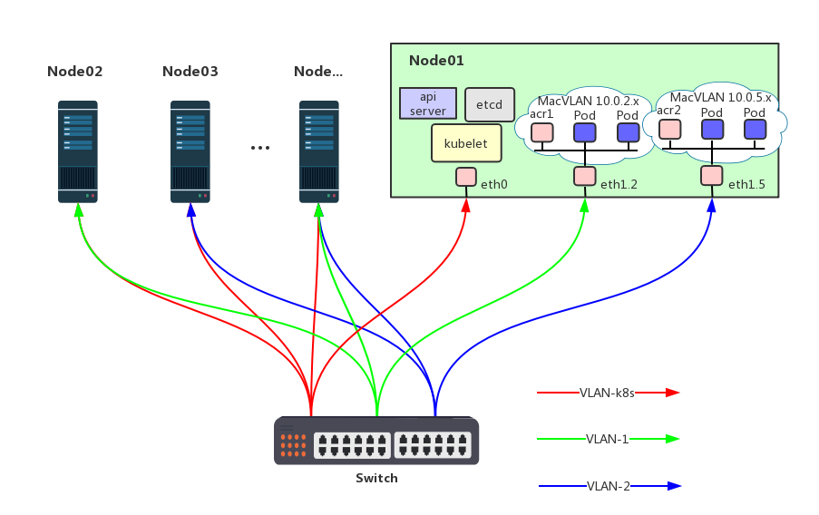
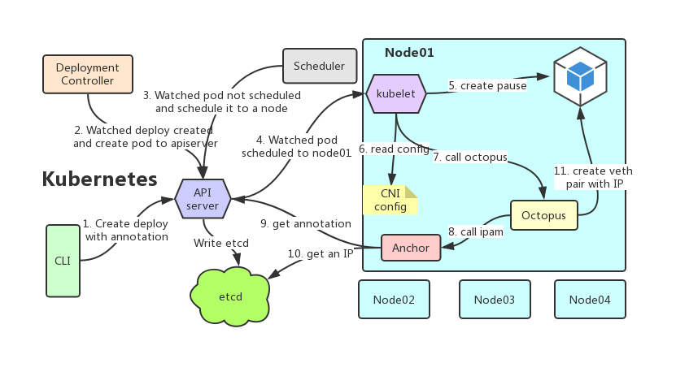

# Anchor and Octopus

Some applications, especially legacy applications or applications which monitor network traffic, expect to be directly connected to the physical network. In this type of situation, users hope using the macvlan network driver to assign a MAC address to each container’s virtual network interface, making it appear to be a physical network interface directly connected to the physical network. 

## There comes anchor

Anchor amis to be a Layer-2 CNI plugin based MacVLAN. See the picture below which shows the network topology of a kubernetes cluster with Anchor as its CNI plugin.



Project anchor mainly contains four components, They are:

* Anchor is an IPAM plugin following the [CNI SPEC](https://github.com/containernetworking/cni/blob/master/SPEC.md).

* Octopus is a main plugin that extends [macvlan](https://github.com/containernetworking/plugins/blob/master/plugins/main/macvlan/macvlan.go) to support multiple masters on the node. It is useful when there are multiple VLANs in the cluster.

* Monkey is a WebUI that displays and operates the data used by anchor IPAM.

* The backstage hero is the installation script of the anchor, which configures and maintains the network interfaces of the node.

## CNI and Kubernetes

CNI(Container Network Interface), a CNCF project, consists of a specification and libraries for writing plugins to configure network interfaces in Linux containers, along with a number of supported plugins. CNI concerns itself only with network connectivity of containers and removing allocated resources when the container is deleted. Because of this focus, CNI has a wide range of support and the specification is simple to implement.

It is worth mentioning that kubernetes is just one of CNI runtimes, others including mesos, rkt, openshift, etc.

The work flow of anchor running inside a kubernetes cluster shown as the picture below.



## MacVLAN

MacVLAN is a Linux network driver that exposes underlay or host interfaces directly to VMs or Containers running in the host.

MacVLAN allows a single physical interface to have multiple MACs and ip addresses using MacVLAN sub-interfaces. MacVLAN interface is typically used for virtualization applications and each MacVLAN interface is connected to a Container or VM. Each container or VM can directly get DHCP address or IPAM address as the host would do. This would help customers who want Containers to be part of their traditional network with the IP addressing scheme that they already have.

When using MacVLAN, the containers is **NOT** reachable to the underlying host interfaces as the packages are intentionally filtered by Linux for additional isolation. This does not meet the SPEC of CNI and causes *service* in k8s cannot work correnctly. To work around it, we create a new MacVLAN interface named *acr1* as shown by the topology, the interface steals the IP and network traffic from the host interface by changing the route table in the host. This work is designed to be done by installation script.

## Installation

Please knowing that, most cloud providers(Amazon, Google, Aliyun) don't allow promiscuous mode, you may deploy Anchor on your own premises. 

Recently, I have no resources(No time, no machines) to test whether anchor works well with other runtimes except kubernetes. The document below focuses on kubernetes.

**Prepare the cluster**

* Enable promiscuous mode on switch(or virtual switch)
* Create a new kubernetes cluster without any CNI plugin
* Reserve several IPs available for applications

**Install Anchor**

```shell
curl -O https://raw.githubusercontent.com/hainesc/anchor/master/deployment/anchor.yaml
```

Edit the anchor.yaml using your favorite editor, *L* means *Line* below.

* Remove L200 and lines below if the k8s cluster has not enabled RBAC.
* L8, input the etcd endpoints used as the store by anchor, see example at the end of the line.
* L10 - L12, input the access tokens of the etcd, remove if SSL not enabled.
* L18, input the choice whether or not create macvlan interface during the installation.
* L22, input the cluster network information. Use semicolon(;) to seperate between items. eg, item *node01,eth0.2,10.0.2.8,10.0.2.1,24* tells install script creating a MacVLAN interface with the master *eth0.2* at the node whose hostname is *node01*, the additional info including IP of the master(*eth0.2* here), the gateway and mask of the subnet(10.0.2.1 and 24). You CAN have Multiple items for each node.

Save the change and run:

```shell
kubectl apply -f anchor.yaml
```

Wait for installation to complete, it will create a daemonset named anchor, a service account named anchor, a cluster role and a cluster role binding if RBAC enabled.

There are several works done by the pod which created by the daemonset on each node:

* Copy binary files named *anchor* and *octopus* to the node
* Config and write a CNI config file named 10-anchor.conf to the node
* Create MacVLAN interface(s) on the node, the interfaces created here will be removed on node restart, but when the node rejoin the k8s cluster, the daemonset recreates a pod and it will recrete the interfaces.

## Run an example

**Preparation**

Before the example, we should initialize the etcd store used by anchor.

There are three k-v stores used by the anchor ipam, they are:

|  KV  |  Example  |  Explanation  |
|:----:|:---------:|:-------------:|
| Namespace -> IPs | /anchor/ns/default -> 10.0.1.[2-9],10.0.2.8 | IPs are reserved and can be used by the namespace in the key |
| Subnet -> Gateway | /anchor/gw/10.0.1.0/24 -> 10.0.1.1 | The map between subnet and its gateway |
| Container -> IP | /anchor/cn/212b... -> 10.0.1.2 | The IP binding with the ContainerID |

At the beginning, the stores are empty, so just input some data following the environment.

I have created a WebUI named [Powder monkey](https://github.com/hainesc/powder) to display and operate the k-v stores. The frontend is written in Angular and the backend written in Golang.

**Run example**

```shell
curl -O https://raw.githubusercontent.com/hainesc/anchor/master/examples/anchor-2048.yaml
```

Edit L14 and choose a subnet for it, then Run:

```shell
kubectl apply -f anchor-2048.yaml
```

Wait for the installation to complete, it will create a deployment named anchor-2048 and a service named anchor-2048.

```shell
kubectl get pods -n default -o wide
```
will displays the IP binding with the Pod.  Open you browser and enjoy the game via the IP of the pod.

Please describe the Pod if some errors, and refer to the log of kubelet for more details.

## Customized

Anchor uses *annotations* written in the yaml for passing customized config as you see in the example.


|  Key  |  Value  |  Explanation  |
|:-----:|:-------:|:-------------:|
| cni.anchor.org/subnet | 10.0.1.0/24 | The Pod should be allocated an IP in the subnet |
| cni.anchor.org/gateway | 10.0.1.254 | The gateway of the pod is overwritten by the customized one |
| cni.anchor.org/routes | 10.88.0.0/16,10.0.1.5;10.99.1.0/24,10.0.1.7 | Add customized routes for the pod |

The *cni.anchor.org/subnet* is **mandatory** since anchor cannot guess an IP if it don't know which VLAN the pod in.

## TODO

* IPv6 support
* K-V store redesign
* Powder monkey improvement

## Donation

If you find anchor is useful and helpful, please consider making a donation.

* Bitcoin: 1HainescwMrDfay9cU1yWC6vc8ThZj8uAQ
* Alipay: zhinhai@gmail.com


